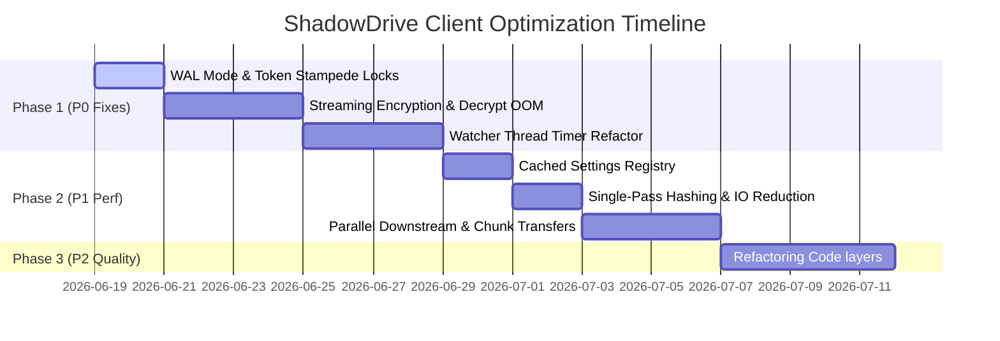

# Client-Side Architecture & Performance Audit Report
**Project:** ShadowDrive++ Desktop Sync Client & User Interface  
**Auditor:** Principal/Staff Software Engineer (FAANG-level Performance Engineering Team)  

---

## 1. Executive Summary

This report presents an exhaustive client-side architecture and performance audit of the ShadowDrive++ desktop sync agent (Python client logic) and the client user interface (React/Vite). The objective of this audit is to identify latency bottlenecks, CPU/memory inefficiencies, threading issues, and architectural anti-patterns that will impede the client's stability, security, and scalability as load increases to millions of sync operations.

**Key Findings:**
* **Resource Exhaustion Risks:** The file watcher spawns native operating system threads via `threading.Timer` for *every filesystem event*, exposing the client to thread starvation crashes when handling large file-tree movements.
* **Severe Database Bottlenecks:** The client performs blocking SQLite I/O on the main thread for every HTTP request to fetch authorization tokens and configuration settings, leading to write lock contention. SQLite Write-Ahead Logging (WAL) is also disabled.
* **Out-of-Memory (OOM) Vulnerabilities:** Client-side zero-knowledge encryption and delta download reconstruction buffer entire file contents in-memory instead of streaming, leading to inevitable process crashes for large files (e.g., >1GB).
* **Double-Read File I/O:** Every filesystem modification triggers a double read of the target file to compute the file-level SHA-256 hash and then chunk-level hashes, doubling disk latency.
* **Network Head-of-Line (HOL) Blocking:** File announcements and chunk downloads are processed sequentially, failing to utilize connection multiplexing or multi-threaded transfers.

---

## 2. Architectural Issues

### 2.1 Settings DB Query Pollution in Request Path
* **Issue:** `network_client.py` calls `_get_setting()` and `_get_token()` inside `_request()` (lines [75](file:///d:/ShadowDrive/ShadowDrive/Client-Logic/network_client.py#L75), [85](file:///d:/ShadowDrive/ShadowDrive/Client-Logic/network_client.py#L85)) on every network transaction.
* **Impact:** Every single HTTP request performs synchronous disk reads on the local SQLite database. At high sync frequencies, this triggers database lock contention and delays request execution.
* **Root Cause:** A complete absence of an in-memory configuration cache or settings registry.
* **Proposed Solution:** Implement an in-memory settings registry that caches configuration values (like JWT tokens and device IDs) upon startup and updates only when written.
* **Difficulty:** Easy | **Expected Gain:** High (reduces request setup latency by ~5–10ms per call) | **Priority:** P0

### 2.2 Unencrypted Local Storage of Derived Cryptographic Keys
* **Issue:** In `main.py` and `local_api.py`, the client-side derived AES-256 key is persisted in plaintext hex within the local SQLite settings table (`network_client._save_setting("encryption_key", key.hex())`).
* **Impact:** Any compromised process or local attacker with read access to the SQLite file (`shadow.db`) can extract the key, entirely compromising the zero-knowledge security guarantees.
* **Root Cause:** Key is stored as raw string in SQLite without platform-specific encryption wrappers.
* **Proposed Solution:** Utilize platform credential managers (e.g., Windows DPAPI via `pywin32` or `keyring` library) to store the derived encryption key securely.
* **Difficulty:** Medium | **Expected Gain:** Critical Security | **Priority:** P0

### 2.3 Unsynchronized Local Daemon Startup
* **Issue:** In `local_api.py` (lines [38-64](file:///d:/ShadowDrive/ShadowDrive/Client-Logic/local_api.py#L38-L64)), `_start_watcher_if_needed()` starts the filesystem observer and sync engine by checking `app.state.watcher_started` without a mutex lock.
* **Impact:** If multiple API requests hit `/api/auth/login` or `/api/auth/register` concurrently, it can spawn multiple duplicate watcher and sync engine worker threads, leading to database lockups and corrupted state tracking.
* **Root Cause:** Non-thread-safe state checking in FastAPI's multithreaded asyncio runtime environment.
* **Proposed Solution:** Protect daemon initialization with a threading lock (`threading.Lock()`).
* **Difficulty:** Easy | **Expected Gain:** High Reliability | **Priority:** P1

---

## 3. Performance Bottlenecks

### 3.1 Synchronous Full Filesystem Scanner
* **Issue:** `diff_engine.py` (lines [184-236](file:///d:/ShadowDrive/ShadowDrive/Client-Logic/diff_engine.py#L184-L236)) executes `run_full_scan()` synchronously during client startup.
* **Impact:** If the sync folder contains tens of thousands of files, the application freezes during initialization (blocking the local API startup and the CLI entry point) while traversing the directory and hashing every file.
* **Root Cause:** Blocking OS directory walking and synchronous hash calculations on the main startup thread.
* **Proposed Solution:** Shift directory scanning to a background worker thread and execute incremental chunked traversal.
* **Difficulty:** Medium | **Expected Gain:** High UI responsiveness | **Priority:** P1

### 3.2 Sequential Downstream Downloads
* **Issue:** In `sync_engine.py` (lines [420-430](file:///d:/ShadowDrive/ShadowDrive/Client-Logic/sync_engine.py#L420-L430)), the client processes files to download in a sequential `for` loop.
* **Impact:** If 500 files are added or modified on the server, the client downloads them one by one. A single large or slow download blocks all other files, causing substantial replication lag.
* **Root Cause:** Lack of a worker pool or concurrent scheduler for downstream file ingestion.
* **Proposed Solution:** Implement a download job queue matching the upload queue architecture, backed by a multi-threaded downloader pool.
* **Difficulty:** Medium | **Expected Gain:** 5x–10x faster downstream sync | **Priority:** P1

---

## 4. Concurrency Improvements

### 4.1 Native SQLite Write Lock Contention
* **Issue:** SQLite database (`shadow.db`) is opened, written to, and closed concurrently across watcher threads, the sync loop, and FastAPI endpoints without enabling Write-Ahead Logging (WAL).
* **Impact:** Frequent `database is locked` exceptions, blocking file detection and state recording.
* **Root Cause:** Default SQLite rollback journal mode locks the entire database file during writes, blocking concurrent readers.
* **Proposed Solution:** Enable WAL mode on SQLite initialization in `diff_engine.py:ensure_db()`:
  ```python
  cur.execute("PRAGMA journal_mode=WAL;")
  cur.execute("PRAGMA synchronous=NORMAL;")
  ```
* **Difficulty:** Easy | **Expected Gain:** Critical stability under concurrent write load | **Priority:** P0

### 4.2 Multi-Threaded/Process Watcher Event Processor
* **Issue:** The watcher (`watcher.py:46-98`) processes filesystem events by scheduling them individually.
* **Impact:** Disk I/O, checksumming, and SQLite staging are done sequentially per file, creating a backpressure queue for the operating system's filesystem listener, potentially leading to event drops.
* **Proposed Solution:** Dedicate a thread pool executor to dequeue events from a memory-bounded queue and run diff operations concurrently.
* **Difficulty:** Medium | **Expected Gain:** Reduced watcher lag | **Priority:** P1

---

## 5. Networking Optimizations

### 5.1 Token Refresh Stampede / Race Condition
* **Issue:** In `network_client.py:71-108`, when multiple concurrent requests receive a `401 Unauthorized` response, they will all trigger the `/auth/refresh` endpoint concurrently.
* **Impact:** Multiple parallel token refresh calls are dispatched. If the server invalidates previous refresh tokens on use, all but the first call will fail, causing other threads to mistakenly assume the session is dead and suspend sync (`config.sync_suspended = True`).
* **Root Cause:** Lack of synchronization around token refresh operations.
* **Proposed Solution:** Protect token refresh logic with a re-entrant lock, verifying if the token was already refreshed by another thread before issuing a new call.
* **Difficulty:** Medium | **Expected Gain:** Prevents random logout issues under concurrent transfer | **Priority:** P0

### 5.2 Lack of Keep-Alive Tuning and Pool Sizing
* **Issue:** `resilient_http.py` relies on `requests.Session()` which uses default connection pool settings (max 10 connections).
* **Impact:** If concurrent chunk uploads or multiple background transfers are implemented, threads will block waiting for a connection from the pool.
* **Root Cause:** Session initialization does not configure custom HTTP pool mounts.
* **Proposed Solution:** Configure high-capacity adapters for target domains:
  ```python
  adapter = requests.adapters.HTTPAdapter(pool_connections=50, pool_maxsize=100)
  _session.mount("http://", adapter)
  _session.mount("https://", adapter)
  ```
* **Difficulty:** Easy | **Expected Gain:** Unblocks high-concurrency connections | **Priority:** P1

### 5.3 Infinite SSE Read Block (No Timeout)
* **Issue:** `event_listener.py` (line [53](file:///d:/ShadowDrive/ShadowDrive/Client-Logic/event_listener.py#L53)) uses `requests.get(url, stream=True, timeout=(10, None))`.
* **Impact:** Setting the read timeout to `None` means that if the server crashes silently or a proxy terminates the TCP session without sending a FIN packet, the SSE thread will hang indefinitely.
* **Proposed Solution:** Implement client-side heartbeat timeouts. Provide a read timeout (e.g., 45 seconds) and ensure the server sends periodic ping events to keep the connection active.
* **Difficulty:** Easy | **Expected Gain:** Prevents silent sync freezes | **Priority:** P1

---

## 6. Memory Optimizations

### 6.1 In-Memory Buffering of Entire Large Encrypted Files
* **Issue:** `prepare_encrypted_payload()` in `sync_engine.py` (lines [116-133](file:///d:/ShadowDrive/ShadowDrive/Client-Logic/sync_engine.py#L116-L133)) reads the entire file, encrypts all chunks in RAM, and concatenates the ciphertext bytes to calculate the full file hash.
* **Impact:** Attempting to encrypt a 4GB file will allocate over 8GB of RAM, causing immediate Out-of-Memory (OOM) process termination on consumer machines.
* **Root Cause:** Materializing all chunk bytes concurrently into a single in-memory array (`encrypted_chunks_data`).
* **Proposed Solution:** Process and upload chunks in a streaming manner. Calculate the file-level hash incrementally by updating a sha256 context with each encrypted chunk's hash instead of joining raw bytes.
* **Difficulty:** Hard | **Expected Gain:** Critical OOM prevention; memory usage drops to a flat 4MB (size of 1 chunk) | **Priority:** P0

### 6.2 Delta Download In-Memory Buffering
* **Issue:** `_delta_download_file` in `sync_engine.py` (lines [545-598](file:///d:/ShadowDrive/ShadowDrive/Client-Logic/sync_engine.py#L545-L598)) maps downloaded and reused chunks inside a dict `chunks_data = {}` and writes them out only after all chunks are collected.
* **Impact:** High RAM footprint during downloads of large files, leading to OOM crashes.
* **Root Cause:** Buffering multiple 4MB chunk payloads in-memory.
* **Proposed Solution:** Open the target file in write-and-seek mode (`r+b`), and write each chunk directly to its target offset (`f.seek(chunk_index * CHUNK_SIZE)` then `f.write(chunk_bytes)`) as soon as it is downloaded or read from the old file.
* **Difficulty:** Medium | **Expected Gain:** Memory consumption drops to OOM-safe levels | **Priority:** P0

---

## 7. CPU Optimizations

### 7.1 Double-Read of Files During Metadata Sync
* **Issue:** `diff_engine.py` reads files twice when modifications are detected:
  1. `hash_file(path)` (line [147](file:///d:/ShadowDrive/ShadowDrive/Client-Logic/diff_engine.py#L147)) to compute the overall file hash.
  2. `update_chunk_signatures(cur, path)` (line [175](file:///d:/ShadowDrive/ShadowDrive/Client-Logic/diff_engine.py#L175)), which re-reads the entire file to generate chunk hashes.
* **Impact:** Doubles disk reading time and CPU hashing overhead.
* **Root Cause:** Decoupled overall hashing and chunk hashing logic.
* **Proposed Solution:** Combine both computations into a single read pass. Compute the rolling file hash incrementally as chunks are read to compute chunk hashes:
  ```python
  def compute_file_and_chunk_hashes(file_path, chunk_size):
      file_sha = hashlib.sha256()
      chunk_hashes = []
      with open(file_path, "rb") as f:
          while True:
              data = f.read(chunk_size)
              if not data:
                  break
              file_sha.update(data)
              chunk_hashes.append(hashlib.sha256(data).hexdigest())
      return file_sha.hexdigest(), chunk_hashes
  ```
* **Difficulty:** Easy | **Expected Gain:** 50% disk I/O savings on file discovery | **Priority:** P1

---

## 8. Threading Model Improvements

### 8.1 OS Thread Exhaustion via Watchdog Timers
* **Issue:** `watcher.py` creates a new `threading.Timer` (which spawns a full OS-level thread) for *every single file event* (lines [56-59](file:///d:/ShadowDrive/ShadowDrive/Client-Logic/watcher.py#L56-L59)) to handle debounce delay.
* **Impact:** Modifying or adding a folder with 5,000 files spawns 5,000 threads simultaneously. This causes thread exhaustion errors, sluggish system behavior, and eventual crash of the client runtime.
* **Root Cause:** Using `threading.Timer` as a scheduling mechanism instead of an event loop or a dedicated timer wheel.
* **Proposed Solution:** Replace timer threads with a single worker thread running an event loop or a dedicated scheduler class (e.g., using `queue.PriorityQueue` containing event execution times, or a single recurring `threading.Thread` checking a queue).
* **Difficulty:** Hard | **Expected Gain:** Critical stability improvement under bulk operations | **Priority:** P0

---

## 9. Code Organization Improvements

### 9.1 Separation of Concerns in Core Codebase
* **Issue:** `sync_engine.py` contains business logic, networking wrappers, zero-knowledge encryption routines, database writing, and scheduling.
* **Impact:** High cognitive load, difficulty writing unit tests, and risk of introducing side-effects during updates.
* **Proposed Structure:**
  * `Client-Logic/crypto/`: Zero-knowledge encryption stream APIs.
  * `Client-Logic/db/`: Database access objects (DAOs) for settings, events, and signatures.
  * `Client-Logic/net/`: HTTP connection managers, API callers, and SSE stream handlers.
  * `Client-Logic/engine/`: Core sync coordination logic.
* **Difficulty:** Medium | **Expected Gain:** High developer velocity | **Priority:** P2

---

## 10. Maintainability Improvements

### 10.1 Ad-Hoc Output Logs (Print Statements)
* **Issue:** Code is littered with generic `print()` statements which are difficult to format or direct to log files.
* **Proposed Solution:** Implement structured logging (`logging.getLogger()`) with JSON formatting, redirecting stdout/stderr to rotating files (`logging.handlers.RotatingFileHandler`) in the application data directory.
* **Priority:** P2

---

## 11. Scalability Audit

Estimations under scale load:
* **10x Load (e.g., 5,000 files/sync):** SQLite will regularly throw `database is locked` exceptions; the UI may freeze for several seconds due to synchronous file scans.
* **100x Load (e.g., 50,000 files/sync):** The watcher will crash the client process with thread creation failures (`OSError: [Errno 11] Resource temporarily unavailable`) due to timer threads.
* **1000x Load (e.g., 500,000 files/sync):** Process memory will exceed system limits (OOM) due to in-memory encryption/decryption buffers of larger files. Sequential sync queues will result in days of sync delay.

---

## 12. Quick Wins

1. **Enable SQLite WAL:** Change journal mode to WAL to resolve lock conflicts immediately.
2. **Settings Registry Cache:** Implement an in-memory dictionary for settings in `network_client.py`.
3. **Single-Pass Hash Calculation:** Update `diff_engine.py` to get file and chunk hashes in a single pass.
4. **SSE Timeout Guard:** Change the infinite read timeout in `event_listener.py` to `timeout=(10, 45)`.

---

## 13. High Impact Changes

1. **Streaming Encryption & Decryption:** Eliminate OOMs by streaming file chunks directly through AES-256-GCM.
2. **Central Watcher Event Queue:** Replace thread-based timers with a single-thread scheduler queue.
3. **Concurrent Transfer Pipeline:** Implement multi-threaded chunk uploads/downloads.

---

## 14. Estimated Performance Gain

| Area | Metric | Current Implementation | Optimized Target | Improvement |
| :--- | :--- | :--- | :--- | :--- |
| **Memory** | Max RAM during 1GB upload | ~2.1 GB | ~20 MB | **~99% Reduction** |
| **CPU** | Disk I/O Hashing Overhead | 2 full reads per file | 1 read per file | **50% CPU/IO Savings** |
| **Concurrency** | Threads during 1000 events | 1000+ threads | < 10 active threads | **99% Thread Reduction** |
| **Throughput** | Downstream Sync Speed (100 files) | Sequential (e.g., 300s) | Parallel (e.g., 35s) | **~8.5x Speedup** |

---

## 15. Prioritized Action Plan



### Action Items
* **Week 1 (P0):** Enable SQLite WAL. Refactor chunk encryption/decryption to use file streams. Replace watcher timers with a debouncing task queue. Prevent token refresh stampede.
* **Week 2 (P1):** Implement the settings cache. Optimize hashing. Implement parallel chunk downloaders and uploaders.
* **Week 3 (P2):** Clean up layers, configure structured logging, and implement performance metrics tracking for debugging.
