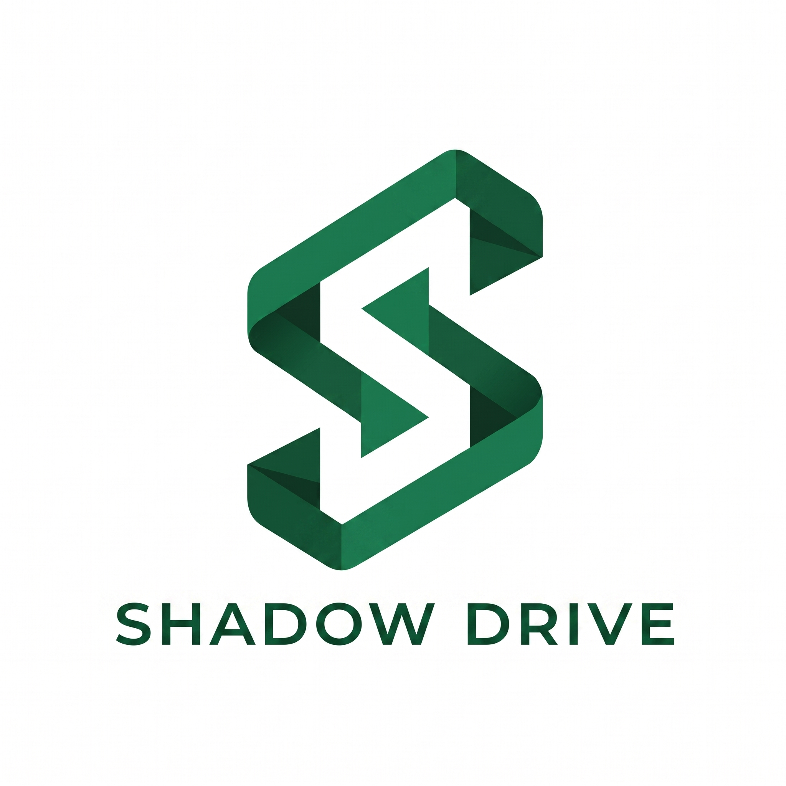

<div align="center">
  <h3><a href="https://baadal.tailb4fef9.ts.net/">🔗 Access the Live Dashboard here</a></h3>
  <h1 style="font-size: 3.5rem;">ShadowDrive</h1>
  
  
  <p><b>Self-hosted, zero-knowledge encrypted file synchronization.</b></p>

  []()
  []()
  []()
</div>

---

ShadowDrive is a decentralized file synchronization platform where the server never sees your data. All encryption happens client-side using AES-256-GCM before files leave your machine.

## ✨ Features

- **Zero-Knowledge Encryption**: AES-256-GCM client-side encryption, server stores only ciphertext.
- **Real-Time Sync**: Watchdog filesystem monitoring with SSE push notifications.
- **Delta Sync**: Only changed chunks are transferred, not entire files.
- **Parallel Uploads**: 4-worker chunked upload pipeline via ThreadPoolExecutor.
- **Version History**: Every file change is tracked and versioned for recovery.
- **Conflict Resolution**: Automatic conflict detection with a manual resolution UI.
- **Modern Web Dashboard**: React/TypeScript UI for monitoring and management.
- **Multi-Device**: Register unlimited devices under a single account.
- **Self-Hosted**: Deploy on your own infrastructure with Docker Compose.

## 🏗️ Architecture

The system consists of three main components:

1. **Server (`Server-Logic`)**: FastAPI/Python application providing REST endpoints, authentication, metadata management, and job queuing. Backed by PostgreSQL for metadata, MinIO for object storage, and Redis for job queues and SSE events.
2. **Client (`Client-Logic`)**: Python sync engine that watches files, encrypts chunks, and synchronizes with the server.
3. **UI (`shadowdrive-ui`)**: React/TypeScript single-page application served by Vite, providing the web dashboard for file management.

## 🚀 Quick Start

Follow these steps to get your local environment running:

1. **Clone the repository:**
   ```bash
   git clone <your-repo-url>
   cd ShadowDrive
   ```

2. **Setup the server environment:**
   Navigate to the server directory and create a virtual environment:
   ```bash
   cd Server-Logic/server
   python -m venv .venv
   ```

3. **Activate the virtual environment:**
   - On **Windows**: `.venv\Scripts\activate`
   - On **macOS/Linux**: `source .venv/bin/activate`

4. **Install dependencies using `uv`:**
   ```bash
   pip install uv
   uv pip install -r requirements.txt
   ```

5. **Install the client:**
   Return to the project root and install the client daemon:
   ```bash
   cd ../..
   bash install.sh
   ```

6. **Run the application:**
   Start the application:
   ```bash
   # On Windows:
   run.bat
   # On macOS/Linux:
   ./run.sh
   ```

> [!TIP]
> You can also access the live remote instance at [Website-Link](https://baadal.tailb4fef9.ts.net/).

## ⚙️ Configuration

The client is configured via `shadowdrive.yaml` in the project root. Key settings include the server URL, watch directory paths, chunk size for delta sync, encryption parameters, and device registration tokens.

## 🛡️ Security Model

ShadowDrive uses client-side AES-256-GCM encryption with a key derived from your passphrase and email using PBKDF2 with 480,000 iterations. Files are encrypted before leaving the device, and the server stores only ciphertext. Even if the server infrastructure is compromised, your files remain confidential. The server never possesses the decryption keys.

## 📄 License

See the [LICENSE](LICENSE) file for details.
